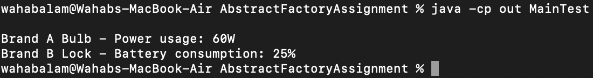

# Abstract Factory + Factory Method — Smart Home Devices

This project demonstrates two design patterns in Java:

- **Abstract Factory**: Choose a *brand family* (BrandA or BrandB) and create related products (Bulb, Lock).
- **Factory Method (timing)**: After an object is created, its **usage** (Bulb → watts, Lock → battery %) is **set** using a value **read from a data file** (CSV). Values are not hardcoded in constructors.

---

## 🧠 How it works (short version)

1. User chooses **Brand A or Brand B**.
2. User chooses **Bulb or Lock**.
3. The brand’s factory **creates** the product.
4. Immediately **after creation**, the factory reads the correct usage value from `data/device_usage.csv` and **sets** it on the object.
5. The product prints its specs.

This satisfies the assignment:
- Abstract Factory ✔️ (BrandA/BrandB create Bulb & Lock)
- Factory Method ✔️ (set usage **after** creation)
- External data ✔️ (values read from a CSV file)

---

## 📂 Project Structure

```
AbstractFactoryAssignment/
│── README.md
│── .gitignore
│── screenshots/
│   └── output.png                 # terminal screenshot
│
├── data/
│   └── device_usage.csv           # fixed values used at runtime
│
├── src/
│   ├── AbstractFactory.java       # + getBrand()
│   ├── UsageFactory.java          # small interface for reading usage values
│   ├── CsvUsageFactory.java       # reads brand+product → value from CSV (read-only)
│   ├── FactoryA.java              # sets usage after creation (uses UsageFactory)
│   ├── FactoryB.java              # sets usage after creation (uses UsageFactory)
│   ├── Bulb.java
│   ├── BulbA.java
│   ├── BulbB.java
│   ├── Lock.java
│   ├── LockA.java
│   └── LockB.java
│
└── test/
    └── MainTest.java                  # simple driver: choose brand/product and show specs
```

---

## 📁 Data File

`data/device_usage.csv` (edit values here if needed):

```
brand,product,value
BrandA,Bulb,60
BrandA,Lock,20
BrandB,Bulb,75
BrandB,Lock,25
```
- **Bulb** → `value` is **watts**
- **Lock** → `value` is **battery %**

> If at runtime you ever see `-1`, it means the CSV key didn’t match. Check for typos (e.g., “Brand A” vs “BrandA”) or extra spaces.

---

## ▶️ How to Compile & Run

From the project root:

Mac:
```bash
rm -rf out
javac -d out src/*.java test/*.java
java -cp out MainTest
```
Windows:
```bash
rmdir -Recurse -Force out 2>$null
javac -d out src\*.java test\*.java
java -cp out MainTest
```


You’ll be prompted in the console:
- `Choose brand (A/B):`
- `Create which product (Bulb/Lock):`

---

## ✅ Expected Results

With the default CSV:

| Choice            | Expected Output                                |
|-------------------|-------------------------------------------------|
| A + Bulb          | `Brand A Bulb - Power usage: 60W`              |
| A + Lock          | `Brand A Lock - Battery consumption: 20%`      |
| B + Bulb          | `Brand B Bulb - Power usage: 75W`              |
| B + Lock          | `Brand B Lock - Battery consumption: 25%`      |

---

## 🧪 Test Results (screenshot)




---

## 📝 Notes on Design

- **AbstractFactory** exposes `createBulb()`, `createLock()`, and `getBrand()`.
- **FactoryA/FactoryB** implement creation and then **set usage after creation** by calling `UsageFactory.load(brand, product)`.
- **CsvUsageFactory** is a tiny, read-only loader for `brand+product → value`. This simulates an external database in a simple CSV.
